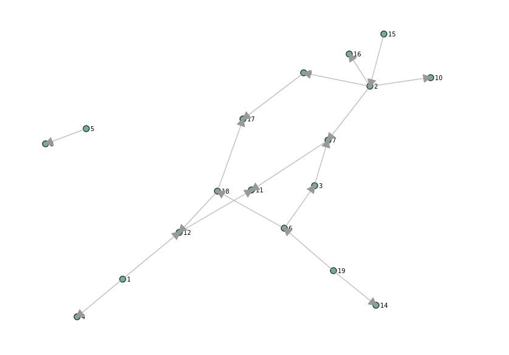

Author: Erkki Seppälä <flux@inside.org>
License: MIT



# GraphPipe: Graph layout with an external interface to provide input

Have you ever thought it would be nice to update GraphViz graphs live? Now you can! Start this thing and:

```
curl -d @mydotfile.dot localhost:8080/graphviz
```

and open your browser to http://localhost:8080/ to view the results.

You can send updated versions of the graph and added nodes will appear
in the graph. (Deletion not yet supported.)

## Compiling

```
npm install && cargo build
```

You may want to use `--features embed-assets` to embed the HTTP data
files inside the binary. In this case it is important to run npm first.

## Running

- `cargo run -- --listen 8080` or `./graphpipe --listen 8080`
- Open your browser at http://localhost:8080
- `echo 'digraph g { a -> b; }' | curl -d @- localhost:8080/graphviz`
